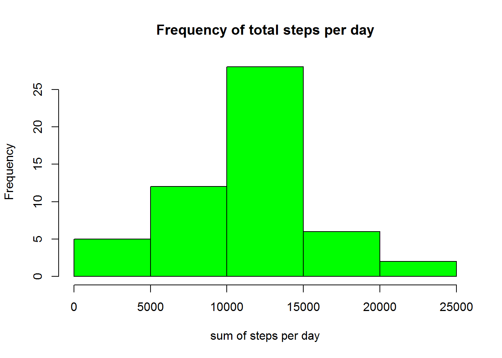
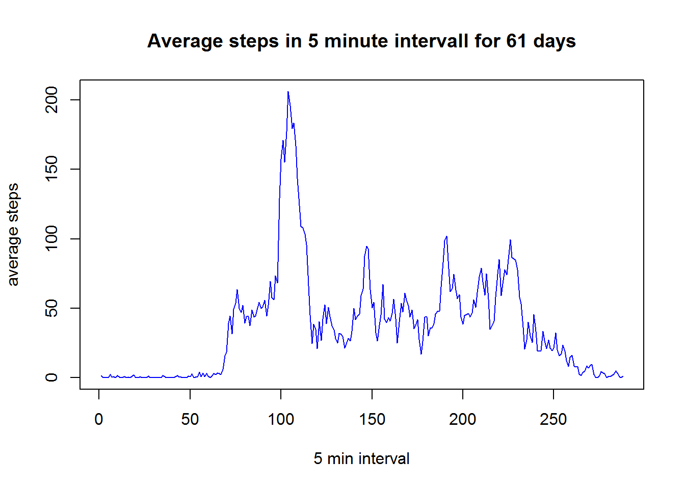
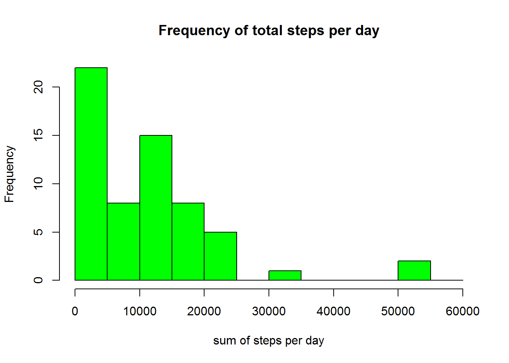
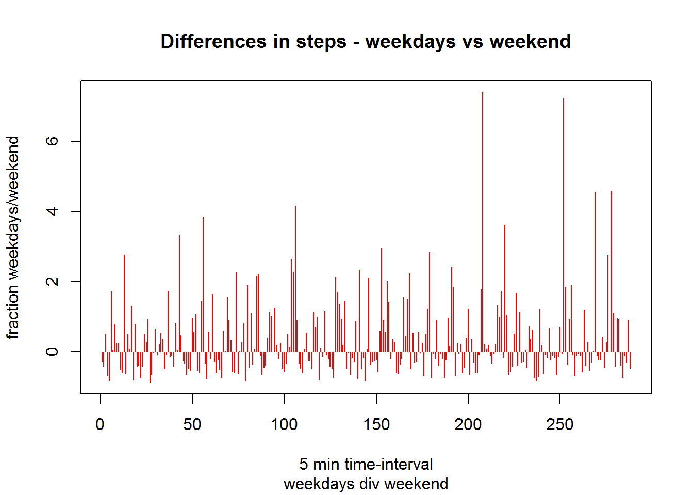

Activity monitoring data analysis
=================================

---
title: "PA1_template"
author: "Tamara Fetzel"
date: "Thursday, February 12, 2015"
output:
  html_document:
    fig_caption: yes
    toc: yes
---

```r
knitr::opts_chunk$set(fig.path='figure/')
```

This document presents an analysis of personal movement data, measured using devices like Fitbit, Nike Fuelband 
or Jawbone Up. The presented data are collected at 5 minute intervals between October and November 2012. The
activity data are used to analyse activity patterns and answer a number of related questions. The first step
is to load the data into R using the following code: 

```r
    activity <- read.csv("activity.csv")
```

##What is the mean total number of steps taken per day?
The dataset is grouped into daily time-steps using the tapply function in R: 

```r
    sumsteps <- tapply(activity$steps, activity$date, sum, na.omit=TRUE)
```

The histogramm shows the relative frequency/occurence of total steps taken each day. Obviously, most participants perform between 10 000 and 15 000 steps per day, this is followed 5000 to 10000 steps per day. In addition, the histogram shows clearly that a large number of steps (e.g. more than 20000 a day) is - in comparison to other classes - rather rare. 


```r
    hist(sumsteps, col = "green", main = "Frequency of total steps per day", xlab = "sum of steps per day")
```

 

The mean and median of the total steps per day are calculated using the following code: 


```r
    meansteps <- mean(sumsteps, na.rm=TRUE)
    medsteps <- median(sumsteps, na.rm=TRUE)
    print(meansteps)
```

```
## [1] 10767.19
```

```r
    print(medsteps)
```

```
## [1] 10766
```
The mean value provides us with information about the average number of steps taken in a day (mean = 10.767), the median is similar with 10766.  

##What is the average daily activity pattern?
The time series plot shows the average number of steps taken in a 5-minute interval (x-axis), averaged across all days (y-axis). In total, each day consists of 288 5-minute intervals (e.g. 12 per hour * 24 hours a day).

Figure 2: 

```r
intmn <- lapply(split(activity$steps, activity$interval, activity$date), mean, na.rm=TRUE)
plot(ts(as.numeric(intmn)), col = "blue", xlab = "5 min interval", ylab = "average steps", 
     main = "Average steps in 5 minute intervall for 61 days")
```

 

This plot (fig 2) shows, that on overage, across all the days in the dataset, the maximum number of steps have been taken in the intervals between approximately 100 and 120. The exact interval is extracted using the following code:

```r
      maxintmn <- which(as.data.frame(intmn)==(max(as.data.frame((intmn)))))
      maxinttime <- activity[maxintmn,]
```
and reveals that the exact maximum number of steps have been taken in the 104 intervall. This corresponds to the: NA, 2012-10-01, 835 (e.g. 08:35) time-interval of the original dataset. 

## Imputing missing values
Dealing with missing values in a dataset is a critical point and modifications and/or assumptions can change the data and hence fundamentally influence conclusions drawn from an analysis based on the respective data. In this context, the data at hand will be used to show the influence of such modifications. For this purpose, all values labeled as "NA" in the original dataset will be imputed using the mean value of the respective time-interval averaged over all available days. 

+ First step:

```r
 sumnodat <- sum(is.na(activity$steps))
```
The total sum of missing values (sum = 2304) in the dataset is calculated using the code displayed above. 

+ Second step:
NA's are filled with the mean for the respective 5 minutes interval over all days. For this purpose a number of modifications to the dataset is necessary: 

Extracting intervall number and corresponding mean value: 
The mean value for each intervall as calculated in the intmn variable (see above) has to be converted into a dataframe and colunns are named using name() function. The activity interval from the original dataset is then converted into a factor varialbe using the as.factor() function. The time-interval is extracted from the original dataset to a new variable called "timeint" which is then assigend to the intmnnew variable resulting in a data frame which contains 1) the intervall number and 2) the mean for each interval. This is the precondition for the next step in which the new data frame will be merged with the original dataset. 


```r
        intmnnew <- as.data.frame(as.numeric(intmn))
        names(intmnnew) <- "meanintmn"
        activity$interval <- as.factor(activity$interval)
        timeint <- activity$interval[1:288]
        names(timeint) <- "interval"
        intmnnew$interval <- timeint

        library(data.table)
        intmnnew1 <- as.data.table(intmnnew)
        activity1 <- as.data.table(activity)

        mergemean <- merge(activity1, intmnnew1, by = "interval")
```

+ Merge datasets
The resulting data frame from the previous step can now be merged to the original data using the "data.table" package. This package enables to merge two tables of different length based on the values of a variable (which both tables have in common, e.g. in this case the "interval" variable). This allows to come up with a data table containing the original information as well as the mean 5-min timeseries value averaged over all days. 

+ Third step: Create a new dataset equal to the original but with the missing data filled in:
To create this final dataset the "NA" values in the original dataset are imputed by the mean values as avialble from the "mergemean" data table using an "ifelse" statement. The new dataset is saved as activityfin:


```r
finsteps <- ifelse(is.na(mergemean$steps),mergemean$meanintmn, mergemean$steps)
activityfin <- activity
activityfin$steps <- finsteps  # the final dataset
```

##Impacts of data-manipulation on the sum of total steps 
Based on this new (modified) dataset, activityfin, the histogram as well as the mean and median value as calcualted in the first part (e.g. the unmodified dataset) of this analysis can be recalculated. This enables a direct comparison of the results and provides insights about how the modification (e.g. filling up NA's with mean values) changed the outcome of the analysis. 

Figure 3:

```r
sumsteps1 <- tapply(activityfin$steps, activityfin$date, sum, na.omit=TRUE)
hist(sumsteps1, breaks = c(0,5000,10000,15000,20000,25000,30000,35000,40000,45000,50000,55000,60000), 
     col = "green", main = "Frequency of total steps per day", xlab = "sum of steps per day")
```

 

In comparison to the first histogram (see fig 1, frequency of total steps per day) the new figure based on the modified dataset (fig 3) shows a completley different picture. Because NA's have been filled with mean values the total sum of steps per day increased in most classes. This is particularly true for the 0 - 5000 steps class. In addition two new classes - eg. 30-35000 and 50-55000 steps have been generated. The new mean and median values have been calculated using the following code:


```r
meansteps1 <- mean(sumsteps1, na.rm=TRUE)
medsteps1 <- median(sumsteps1, na.rm=TRUE)
print(meansteps1)
```

```
## [1] 10767.19
```

```r
print(medsteps1)
```

```
## [1] 10311.98
```

When comparing the mean and median values from the original dataset (10767/10766) to the new
(10767 / 10312) it becomes clear, that despite the changes to the dataset the mean does not change, however, due to the additional values in the dataset the median decreases from 10766 to 10312. 

##Differences in activity patterns between weekdays and weekends
Another interesting question is if there are differences in the activity pattern between weekends and weekdays. Using the weekdays function it is possible to extract the weekdays from the date column in the dataset created in the previous step. An ifelse statement helps to assign the attributes "weekdays" and "weekend" to the dataset. 


```r
        library(lubridate)
        activityfin$date <- as.Date(activityfin$date, format = "%Y-%m-%d")
        week <- as.data.frame(weekdays(activityfin$date))
        activityfin$fact <- factor(ifelse(week=="Samstag" | week=="Sonntag", "weekend", 
                                          "weekday"))
```

The panel plot displayed in figure 4 shows the time-series distribution of the average steps taken per time-interval on weekends and weekdays. To produce the plot it is necessary to subset the dataset (e.g. activityfin) to extract weekday and weekend estiamtes. In a next step the mean steps per time-intervall is caluclated using lapply() function in conjunction with split(). 


```r
        wd <- subset(activityfin, activityfin$fact=="weekday")
        we <- subset(activityfin, activityfin$fact=="weekend")

        wd1 <- lapply(split(wd$steps, wd$interval), mean, na.rm=TRUE)
        we1 <- lapply(split(we$steps, we$interval), mean, na.rm=TRUE)
```

Figure 4: 

```r
        par(mfrow = c(2,1),  mar = c(4,4,2,1), cex = 0.7,  oma = c(2,2,2,2)) 
        plot(ts(wd1), col = "blue", main = "weekday", xlab = "", ylab = "average steps")
        plot(ts(we1), col = "blue", main = "weekend", xlab = "5 min time-interval", ylab = "average steps")
```

 

When looking at these two plots it is slightly difficult to really quantify the differences between weekends and weekdays visually.
For this reason another figure (fig 5) showing the fraction between these two datasets is presented. This is done by calculating the fraction between weekdays and weekends per time-interval (e.g. weekdays/weekend). A negative difference indicates that the average number of steps on weekdays is lower than on weekdays (e.g. 36 steps compared to 50 steps on average). 

Figure 5:

```r
        wd2 <- as.data.frame(wd1)
        we2 <- as.data.frame(we1)
        diff <- as.numeric((wd2/we2)-1)
        plot(diff,nrow(diff), type="h", col="red", ylab = "fraction weekdays/weekend",
             xlab = "5 min time-interval", main="Differences in steps - weekdays vs weekend", 
             sub="weekdays div weekend")
```

 


